# Access the report
Click [here](https://github.com/Projektkurs-HT21/Report/blob/main/Report.pdf) for the current main version of the report.

# Kom igång
Här går vi igenom hur man installerar allt som krävs för att bygga rapporten, hur man laddar ner den och hur versionshantering fungerar.


## Vad är Git?
_Git_ är det verktyget vi använder för versionshantering. Tanken med versionshantering är att man ska kunna ha flera personer som jobbar på samma dokument, på olika datorer. Man laddar ner projektet på sin dator och gör ändringar. Efter det applicerar man ändringarna på projektet som ligger på internet. Fördelen med detta är även att man får en väldigt tydlig karta på alla versioner av ett projekt, och alla ändringar som har gjorts mellan dem.

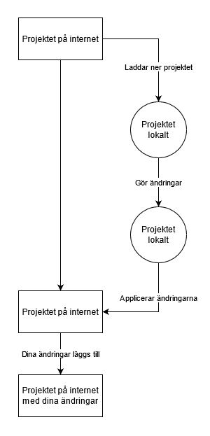

Det man också kan göra med Git är att man skapar det som kallas _branches_. En branch är en kopia på projektet där man kan göra ändringar och senare kombinera branchen med huvudversionen av projektet.

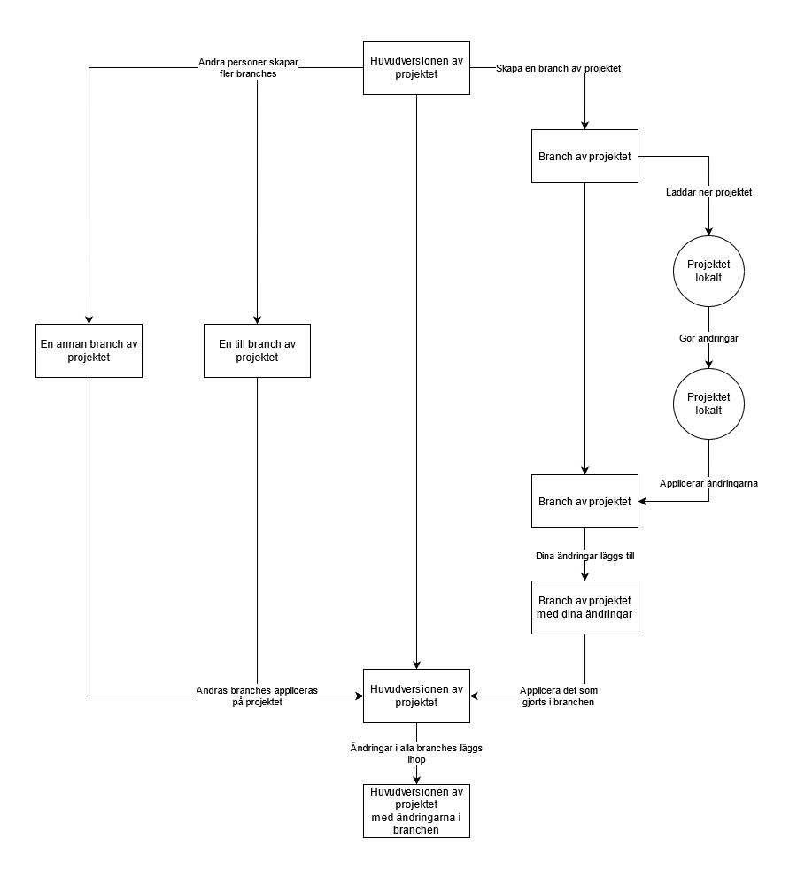

Anledningen till att man använder branches är för att olika personer ska kunna jobba på olika saker i samma projekt, men att ingenting som någon annan person gör på sin branch ska påverka det du gör på din branch (tills dess att man lägger ihop allting). 

Här är lite Git terminologi som kan vara bra att veta

* Repository - Ett projekt bestående av en mappstruktur med en massa filer 
* Commit - En ändring som man gjort på sin dator och vill applicera
* Push - En push är när du tar alla commits du gjort och skickar upp dem till servern där projektet ligger.
* Main - Branchen där huvudversionen av projektet ligger
* Origin - Den servern eller liknande du vill pusha till.  I vårt fall är det Github.

Det vi kommer göra med rapporten är att den kommer vara ett eget Git repository. Där kan du eller er grupp göra en egen branch för era ändringar av rapporten, som allt kan lagras på Github. Sedan kommer Josef att ta alla branches och lägga ihop dem i main branchen, vilket kommer sluta i ett enda dokument.

## Skapa ett konto på Github
_Github_ är en server/sida där man kan hosta Git repositories. Det är mot Github rapporten kommer att synkroniseras, och det är även där vi kommer sköta det mesta av versionshanteringen.

Gå in på [Github](https://github.com/) och skapa ett konto. Använd din studentmail när du registrerar dig, då det kommer göra det enklare för dig att få tillgång till Githubs studentförmåner. När du skapat ett konto, skriv i _\#git_ kanalen på Discord eller direkt till Josef (CPUToast) för att få tillgång till Github-organisationen där rapportprojektet ligger. När Josef sagt att han skickat en invitation till dig, kommer det att dyka upp ett mail där du får godkänna att du vill gå med i organisationen.

## Installera Sublime Text
_Sublime Text_ är en lightweight textredigerare, som kommer vara enkel att skriva LaTex i. Börja med att installera den, och installera därefter Github Desktop. Du får välja vilken textredigerare du vill, men Sublime Text är den jag rekommenderar.

Börja med att ladda ner Sublime Text från [Sublimes hemsida](https://www.sublimetext.com/download). Du kan välja alla default inställningar för Sublime Text. 

För att öppna Sublime kan du sedan bara söka _Sublime_ i startmenyn på Windows.

## Installera MikTex
_MikTex_ innehåller en massa saker som krävs för att kompilera LaTex-kod till ett dokument, på samma sätt som exempelvis Overleaf gör automatiskt när man skriver i det. Börja med att gå till [MikTex hemsida](https://miktex.org/download) och ladda ner MikTex. Välj default alternativen för allt utom för _Install missing packages on-the-fly_, där det blir enklare för dig att bara välja _Yes_.

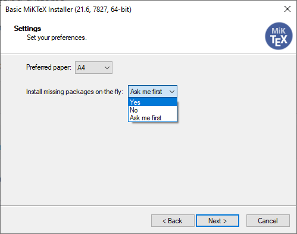

## Installera LaTexTools
LaTexTools är ett plugin för Sublime Text som gör att man kan kompilera LaTex-kod i direkt i Sublime Text, via MikTex.

Börja med att installera Sublime Texts pakethanterare. Gå till ```Tools > Install Package Control...```. Det kommer installera sig själv utan några problem.

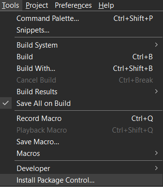

När det installerats, gå till ```Preferences > Package Control```.

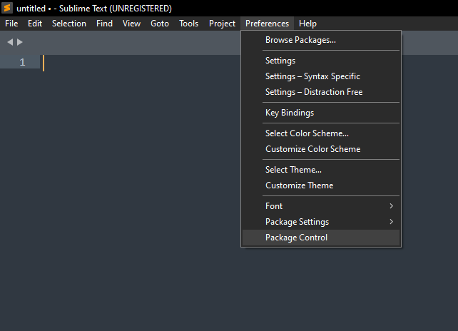

Då får du upp Sublime Texts pakethanterare, med några alternativ. Välj _Package Control: Install Package_.

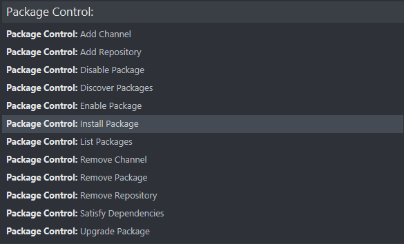

Det kommer ge dig en sökruta där du kan söka efter packet att lägga till. Sök på _latextools_, och tryck på det paketet för att installera.

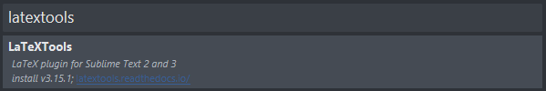

Den kommer installera och sedan öppna ett dokument med lite information om LaTexTools. Det är inte jätteväsentligt, så det är bara att stänga.

Nu behöver du bara göra en inställning för LaTexTools, för att det ska funka smidigt. Det finns en inställning som säger att LaTexTools ska försöka öppna en specifik pdfläsare när den kompilerat, som inte finns förinstallerad. Du kan installera den om du vill, men jag föredrar att bara ställa in LaTexTools att inte öppna en pdf när den är klar. Gå till ```Preferences > Package Settings > LaTexTools > Settings - User```. 

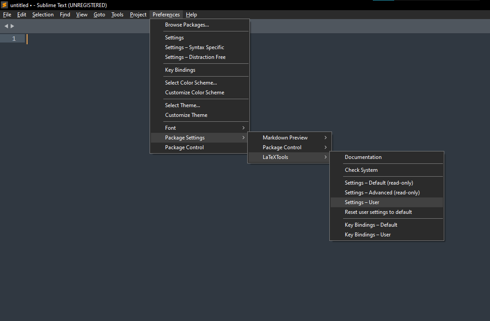

Säger den att det inte finns någon Settings - User kommer den fråga om du vill skapa en, vilket du kan göra. I settings filen som kommer upp kan du söka efter ```open_pdf_on_build```. Efter det står det _true_, vilket du kan byta till _false_

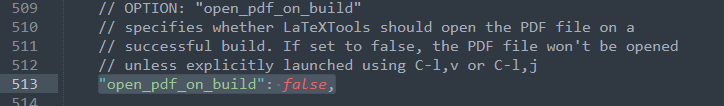

Spara sedan settings filen.

Nu ska du kunna kompilera rapporten, förutsatt att du installerat MikTex och LaTexTools korrekt. Du kan testa senare när du laddat ner Gihub Desktop och projektet.

## Installera Github Desktop
För att ni ska slippa den jobbiga delen med Git rekommenderar jag att man som nybörjare använder Github Desktop. Github är servern/sidan som vi synkroniserar rapportprojektet till. De är inte det enda stället man kan spara sina Git repositories på, men det är vad vi använder.

Ladda ner Github Desktop från [Githubs hemsida](https://desktop.github.com/). Den kommer installera allting själv, och kommer sedan visa en _Let's get started!_ sida.

## Klona projektet
Nu ska du klona projektet. Det betyder att du kommer ladda ner projektet och spara det lokalt, men att det fortfarande räknas som ett Git projekt vars ändringar du kan skicka upp tillbaks till Github. 

Välj _Clone a repository from the internet..._ i Github Desktop.

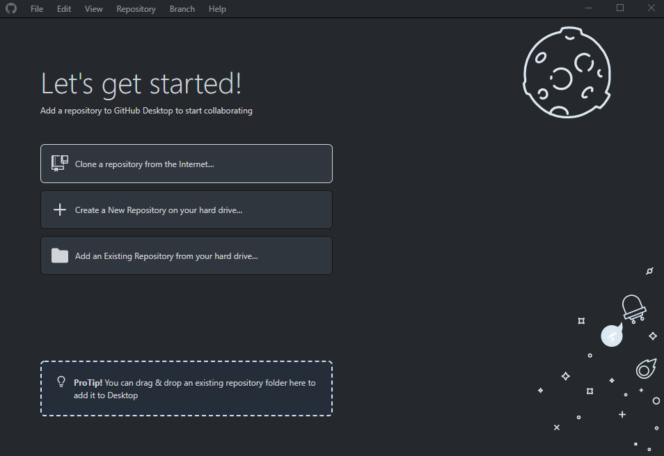

Där kommer den be dig logga in. Tryck på _Sign In_ och _Continue with browser_ för att låta Github Desktop öppna din webbläsare och hitta Githubkontot som du är inloggad på i webbläsaren. Det bör vara kontot som du gett till Josef, för att du ska få tillgång till organisationen som alla projektkurs-projekt ligger under. Den kommer hoppa mellan webbläsaren och Github Desktop, och logga in dig.

Nu kan du välja projekt bland dina repositories. Hitta _Projektkurs-HT21/Report_, tryck på den och välj _clone Projektkurs-HT21/Report_.

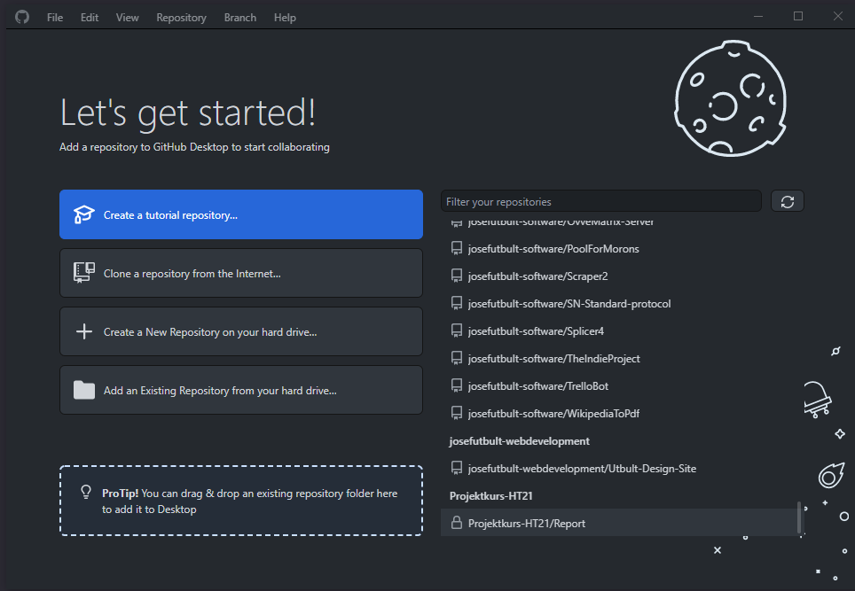

Den kommer öppna ett fönster där adressen till repositoriet redan är inskriven, men du kan även ändra vart den ska ladda ner projektet på datorn. Fortsätt med att trycka på _Clone_, och den kommer att hämta ner projektet.

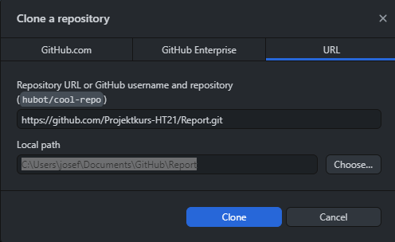

## Välj textredigerare
För enkelhetens skull kan du välja vilken textredigerare som Github Desktop ska använda för att öppna filerna i projektet. Gå till ```File > Options```.

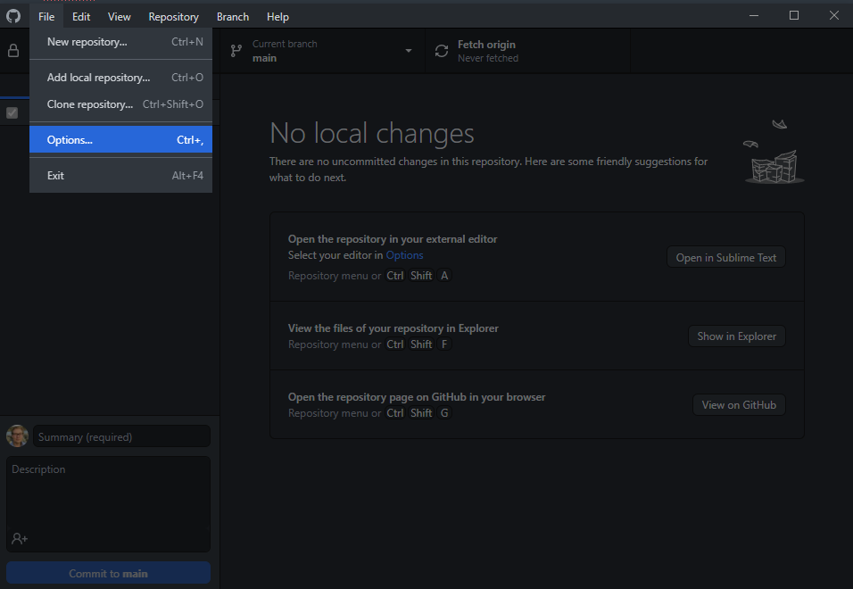

I Options, gå till _Integrations_ och under _External editor_ välj Sublime Text. Spara sedan och gå ut ur Options.

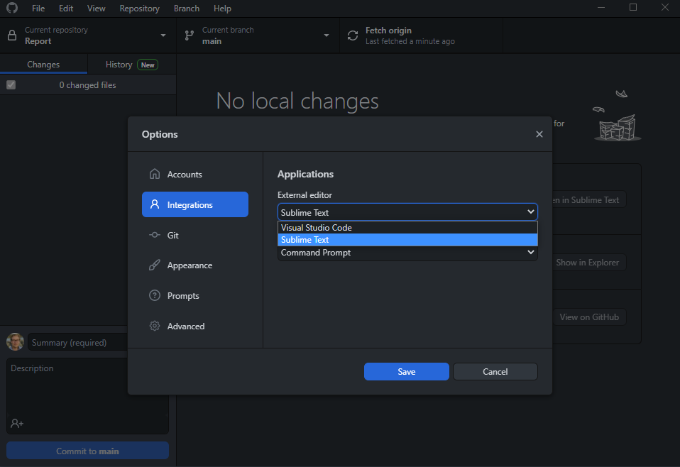

Nu kan kommer valet att  _Open in Sublime Text_ dyka upp på projektsidan i Github Desktop.

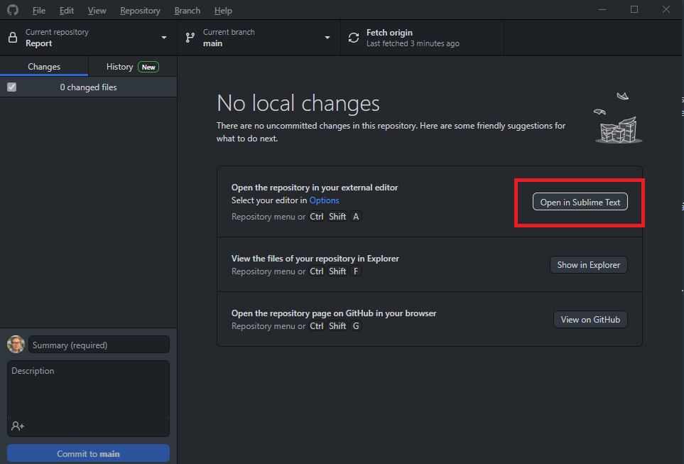

## Checkout en ny branch
Antingen väljer ni i er grupp att ha en enda branch där alla jobbar i, eller att alla får ha varsin. Det jag rekommenderar är att varje gruppledare (eller den som känner sig mest bekväm med Git) först gör en ny branch från main för er grupp, och att denna sedan gör en branch för varje medlem ifrån gruppens branch. Dessa kan sedan mergas in i gruppens branch av gruppledaren, och sedan av Josef in i main.

För att byta branch, välj _Current branch_ ganska högt upp i fönstret, och välj antingen en av branchens som finns tillgängliga i listan eller skapa en ny branch. Skapar du en ny branch kommer Git att göra en kopia av allt ifrån den branchen du är i nu (main) och göra en ny. Denna kopia kan sedan pushas upp till Github och mergas ihop med main-branchen. När du skapat en ny branch på Github Desktop kommer det komma upp ett alternativ som heter _Publish Branch_, vilket betyder att du publicerar på Github att du skapat en ny branch. Det är inte nödvändigt då det ändå kommer dyka upp på Github när du senare gör en commit, men du kan välja att publicera branchen också.

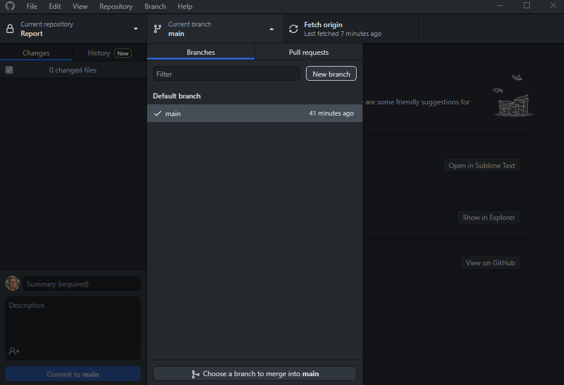

Glömmer du det här steget, och pushar upp direkt till main branchen, kommer Josef ta bort det du gjort i den branchen. Josef ser till att flytta dina ändringar någonstans passande, men historiken för projektet kommer bli väldigt konstig om inte alla ser till att pusha till korrekta branches.

Nu när du checkoutat till en ny branch kan du välja  _Open in Sublime Text_ på projektsidan, och Github Desktop kommer öppna projektet i Sublime Text.

## Kompilera rapporten
Nu kan du äntligen testa att bygga rapporten! Gå in på Github Desktop och välj _Open in Sublime Text_, vilket kommer öppna projektet. Huvudfilen för rapporten är ```Report/index.tex```, och för att kompilera behöver du öppna den. Första gången du ska bygga rapporten behöver du välja vilket verktyg du ska använda. Då du vill ha ut rapporten i PDF format, bör du välja _pdflatex_. Gå till ```Tools > Build With```.

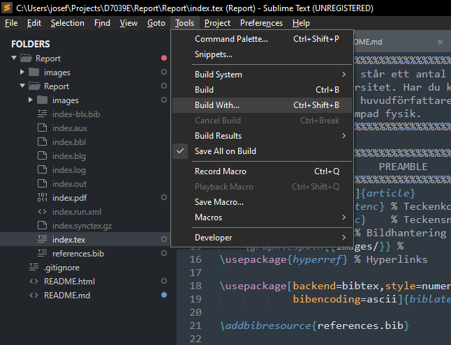

Där får du några alternativ för vad du vill bygga projektet med. Välj _LaTeX - PdfLaTeX_.

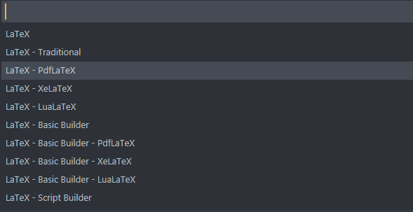

Det kommer bygga projektet, och förhoppningsvis står det ```[Finished in 0.0s]``` i botten av Sublime Text. Nu bör det ligga en pdf vid namn _index.pdf_ i samma mapp som index.tex. Öppnar den fönster och frågar om du vill installera bibliotek för att få MikTex att fungera, kan du bara välja _Yes_ på allt.

När du vill bygga i framtiden behöver du inte ställa in hur du vill bygga projektet, utan då räcker det att välja ```Tools > Build``` för att bygga. Det fungerar också med ```CTRL + B``` på Windows eller Linux. 

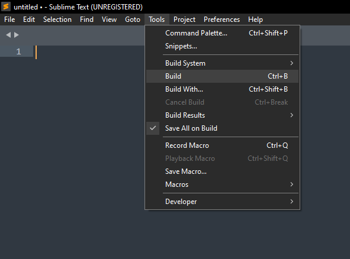

## Commit och Pusha dina ändringar
När du gjort dina ändringar är det dags att pusha till Github, dvs skicka upp ändringarna på din branch till Github. För att göra det behöver du först göra en Commit. En Commit betyder att, när du har gjort en del ändringar, vill applicera dem i projektet för att skapa en ny version. Resultatet blir att man kommer kunna se skillnaden mellan de olika commitsen/versionerna, och exakt vad som ändrats mellan dem.

Följande förutsätter att du checkoutat till en annan branch än main, eller skapat en ny branch från main. På Github Desktop kommer du se en lista med alla filer som har ändrats sedan senaste gången du committat. Det finns också en liten ruta nere till vänster med ett _Summary_ textfält och en _Commit to <Branch name\>_ knapp. Först måste du skriva en sammanfattning över vad som är skillnaden ifrån den senaste commiten. Sedan kan du trycka på _Commit to <Branch name\>_.

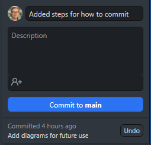

Nu har du gjort en commit, dvs du har sparat en ny version av projektet lokalt på din dator. Nästa steg är att pusha dina ändringar till Githubs server. Du kan egentligen göra hur många commits du vill lokalt, och sedan pusha alla till Github samtidigt, men vi gör det direkt nu. För att pusha kan du antingen välja _Push origin_ som kommer direkt efter att du gjort en commit, eller att trycka på _Push origin_ i toppen på Github Desktop fönstret.

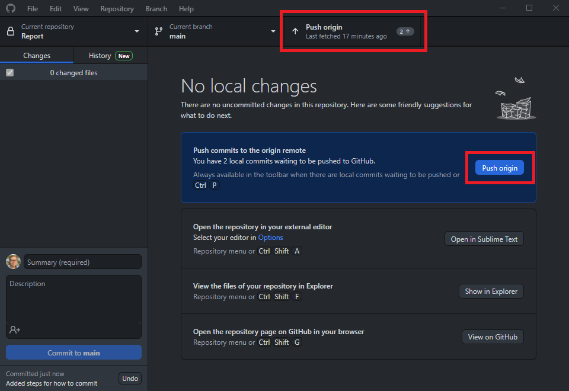

## Sammanfattning
Dokumentet har gått igenom vad Git och Github är, hur man använder Github Desktop för att hantera ett Git projekt, hur man installerar en textredigerare och en latex kompilator samt hur man committar och pushar till Git. 

Undrar du något är det bara att skriva till Josef (CPUToast) på Discord. Josef ska även utöka det här dokumentet med hur rapporten ska struktureras och med lite FAQ.

## Konventioner
Här är lite konventioner. Då vi är femton personer som skriver på samma dokument och använder samma repon, är det viktigt att alla följer dessa.

### Kommentarer på kod
Kod ska inte kommenteras för mycket. Det betyder att varje rad av en funktion eller liknande inte behöver en egen kommentar för vad den gör. Behöver den det bör du skriva bättre kod. Variabel- och funktionsnamn bör vara nog tydliga för att man ska förstå dess funktion.

För att dokumentera vad en funktion gör, utöver dess namn, kan en kommentar över funktionen användas.

Exempel på en bra kommenterad funktion

```python
# A function for those of you who dont know what to do. Takes an input, 
# increments and returns a boolean
def i_dont_know_what_im_doing(some_var):
	some_var += 1
	if some_var > 5:
		return False

	return True
```

Här är ett tydligt funktionsnamn, med en kommentar ovanför som beskriver vad den gör.

Exempel på en dåligt kommenterad funktion.

```python
def dont_know_func(var):	# A function that dont knows
	var += 1				# Increments var
	if var > 5:				# Check the size of var and returns false if it is bigger than five
		return False

	return True
```

Här är funktionsnamnet och variabelnamnet dåligt beskrivande. Varje rad har en kommentar som beskriver vad raden gör trots att det är ganska tydligt när man tittar på koden. Det resulterar i alldeles för mycket kommentarer.

### Commit messenges
Sammanfattningen av en commit, dvs ett commit messenge, ska vara kort och beskrivande. För att underlätta för Jan ska commit messenges vara på engelska, och de ska också beskriva _vad som är skillnaden från föregående commit_ och inte _vad du gjort_.

Exempel på ett bra commit messenge.

```
Add this function to this thing
```

Här beskrivs kort om vad som är skillnaden från förra versionen; att något lagts till.

Exempel på ett dåligt commit messenge.

```
Added this function and did some other stuff. Made some comments and moved a function two lines up.
```

Här beskrivs vad du personligen har gjort. Det är för mycket text och en hel del av det är inte väsentligt för att få en översikt över projektets olika versioner.

### Branches
Det viktigaste är att ni inte pushar till main branchen. Det gäller alla repositories. Gör en ny branch eller checkouta till en existerande, committa dina ändringar och gör ett pull request till mainbranchen. Om du inte vet hur det fungerar, fråga din gruppledare eller den som är ansvarig för Git i gruppen.

Den som är ansvarig för Git i gruppen har i uppgift att acceptera pull requests; för era egna repositories får ni merga in i main, och i de delade repositories får ni merga in i gruppens branches.