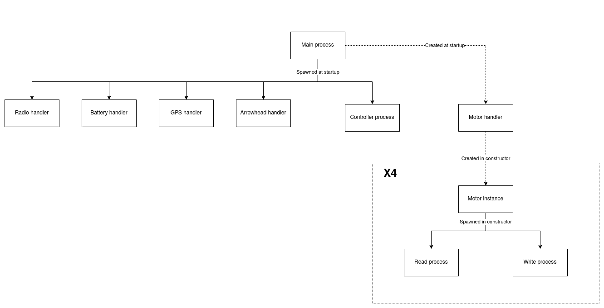

# Running the robot

To run the robot, go to the directory with the python project.

```shell
cd /home/pi/Robot
```

Then run the application.

```shell
python3 app.py
```

The application has some arguments that can be used to specify how it should be run.

	-h, --help            show this help message and exit
	-d, --debug           Run robot in debug mode.
	-m, --motor-debug     Enable debugging for the motors.
	-s, --simulate        Run robot in simulation mode, which can be run on a none-rpi system.
	-a, --arrow-debug     Enable debugging for Arrowhead.
	-r, --radio-debug     Enable debugging for the radio receiver.
	-c, --control-debug   Enable debugging for the controller.
	-t, --auto-terminate  Auto terminate application after 5 sec.


# Robot setup

## Pull Robot project from Github

Generate a new ssh key on the raspberry.

```shell
ssh-keygen
```

You can use the default on all the settings during the setup. Then add the generated ssh key from the raspberry to Github. Run the following command to get the key.

```shell
cat /home/pi/.ssh/id_rsa.pub
```
Copy the output to Github.

When the key is added you can pull the project from Github

```shell
git clone --recurse-submodules git@github.com:Projektkurs-HT21/Robot.git
```

## Install requirements
Install the following for numpy to work

```shell
sudo apt-get install libatlas-base-dev
```

Upgrade pip to the newest version.

```shell
python3 -m pip install --upgrade pip
```

Then install all python packages

```shell
cd Robot
pip3 install -r requirements.tex
```

# Adding functionality
To add a new python file that is supposed to run on the robot, do the following.

## Import the project as a submodule
Start by importing the project containing the code as a submodule for this project

```shell
git submodule add <SSH link>
```

## Make the project into a python module
Make the project into a package module that the application can import. Create the file _\_\_init\_\_.py_ in the top directory of the submodule.

```shell
touch <SUBMODULE PATH>/__init__.py
```

Do this for every sub folder in the submodule that has a python file that needs to be run.

## Reference all imports as relative from root
For the imports between files in your submodule to work when they are referenced from the python application, you need to make all imports relative to the _Robot_ directory. The syntax will be.

```python
import <SUBMODULE>.<FILENAME>
```

## Create a process in app.py
The application uses the [multiprocessing library](https://docs.python.org/3/library/multiprocessing.html) to be able to run different processes at the same time on different CPU cores. In app.py there is a dict called _processes_. Add a key for your process and a new process as a value for it.

```python
processes = {
	mp.Process(name="Controller", target=controller.run),
	mp.Process(name="<YOUR PROCESS NAME>", target=<YOUR FUNCTION>)
	}
```

For the new process to terminate successfully, you should pass the `stop_event` to it. This event will be set when a terminate signal is sent to the program, so make sure your process checks this event reguraly and terminates the process correctly if this is set. To get access to the commandline arguments passed into the project you can access the object `args`.

## Project structure

### Project structure on the Robot
The structure of the program on the robot, containing the controller and all hardware integration, works by utilising a set of separated processes in order to maximise the time that the operating system dedicates to the program. This results in every hardware interface component of the system working asynchronously with the controller, in order to never halt the controller for it to wait for a hardware interface to communicate. This was not strictly necessary, as our program didn't claim that much processing power anyways and wasn't very time sensitive. But as our goal was to have fun, this was absolutely the most fun and interesting way to do it.

The objects created and processes spawned are depicted in the following diagram. Creation of object instances are represented as dotted lines and are located in the same process as the objects creator, and spawning of new processes alongside creation of new object instances are represented as filled lines.



### Main process
The main process of the robot program is dedicated to initialising, creation of objects and spawning of child processes. This process is also in charge of waiting for a keyboard interrupt and stopping all other processes correctly. This is done using a _stop event_, which is an event distributed to each child process that when set should notify all processes that they should terminate. 

The main process creates single instances of the Controller class, the Arrowhead handler class, the GPS handler class, the Battery handler class, the Radio handler class and the Motor handler class.

### Controller process
The controller process is tasked with running the controller functionality periodically. This object has access to the motor handler object, the battery sensor object, the GPS handler object and the _control mutex_. The controller starts by reading states from the different objects. Then it compiles these states into a JSON object for Arrowhead to transmit to the base-station. Then it will try to acquire the control mutex, which specifies that the controller has the right to write to the motors. This acquiring can be done as long as the radio handler has released the control over the mutex and allows the robot to run autonomously. If it succeeds in acquiring the mutex, it will write new RPM values and positions to the motor handler.

### Motor handler
The motor handler object is in charge of creating the different motor driver objects that corresponds to the different motors connected to the robot. It also has access to the different shared values and locks from the different motor driver objects and handles the communication from the controller process and the radio handler process to the different motors processes. 

When a value is written to a motor in the motor handler, this will cause it to write a new RPM or position to a motors write value, which is shared between processes, and then trigger the motor object in order for it to write to the motors connected peripheral. When a read from a motor is requested the motor handler will trigger the motor object to start reading from its connected peripheral. When the read is done the motor handler will then be able to get the state of the motor and deliver the read to different processes.

### Motor driver
There are two different classes of motor objects on the robot. 

The VESC motor driver class is in charge of communicating with the connected VESC drivers over UART. There are three VESC drivers on the robot: The right band wheel, the left band wheel and the rotational axis of the blower.

The STM32 drivers are all connected to a single STM32 processor over UART, that is in charge of reading the battery levels and controlling the three servos on the robot. There are read and write locks in place that are shared between all the STM32 drivers for them to share control over the same UART lines. The battery handler also shares these locks. There is three STM32 drivers that all corresponds to a separate servo.

Every motor driver spawns two processes of their own. There is the read process that waits for a read event to be triggered by the motor handler and when triggered writes the value stored in the motors write object to the peripheral. There is also the write process that waits for the motor handler to trigger the write event, and when triggered first writes to the peripheral what value it wants to read and then reads the current state from the peripheral and puts it in the motor drivers read object.

This structure with different read and write processes allows the motor to send a read command, and at the same time as it waits for a response from the peripheral, write new values to the peripheral. This makes the motor work asynchronously without forcing the writing of new values to the motor to wait for reads to finish.

### Radio handler
The radio handler process is tasked with continuously read data from the radio receiver connected to the raspberry over UART. When the radio handler has read the raw data package generated by the receiver, it parses this to the different channels in the package. There is a channel specified for a toggle switch on the radio controller that is used to define if the robot should be in autonomous or manual mode. 

If this switch is set to manual mode, the radio handler will acquire the _control mutex_ which will let the radio handler write to the motor handler. When this is acquired, the radio handler will have full control over the robot and can relay the different values from the radio controller to the motor handler, which in turn will write these values to the different motors. 

It this switch is set to autonomous mode, the radio handler will release the control lock and wait for the switch to be set back to autonomous mode, which in turn will let the Controller object acquire control over the robot and run the robot autonomously.

### Arrowhead handler
The Arrowhead handler process starts up the Arrowhead program as a sub-process, and pipes its output to the Python logging module in order to get all messages into a log file.

### Arrowhead process
This application begins with the arrowhead orchestration process after which is starts polling the server for the path it is supposed to follow. During this polling it also sends its latest state which is required by the pathfinding algorithm to create the paths.
After the path is received the application then continues to send its state to the server whilst continually fetching the reference speed used by the controller.

### GPS handler
The GPS handler will continuously read raw data from the GPS unit that is connected to the raspberry over Ethernet. This data gets parsed to the current position and direction of the robot, and is then stored in objects that are accessible from different processes. When a process then requests this data, the GPS handler will read the values from these stored objects and return them to the caller, making the GPS handling an asynchronous process.

### Battery handler
The battery handler is tasked with periodically reading the battery level from a external STM32 micro-controller putting it in a shared object. When another process calls for this value, it will return the last read from the battery from that shared object. The micro-controller measures the battery-voltage using multichannel ADC together with a voltage divider.

## Hardware

### Battery connections
- [ ] Batteries
- [ ] Power regulators
- [ ] Battery sensors

### GPS connection
- [ ] GPS network connection
- [ ] Power

### VESC driver connections
- [ ] Connection order on PI
- [ ] Motor connection

### STM32 driver connections
- [ ] Servo order on Blackpill
- [ ] Power

### Radio receiver
- [ ] Connection

## GPS 
- [ ] Initialization
- [ ] Base station positioning

## 3G Modem
- [ ] Ethernet connections
- [ ] Setup
- [ ] 3G
