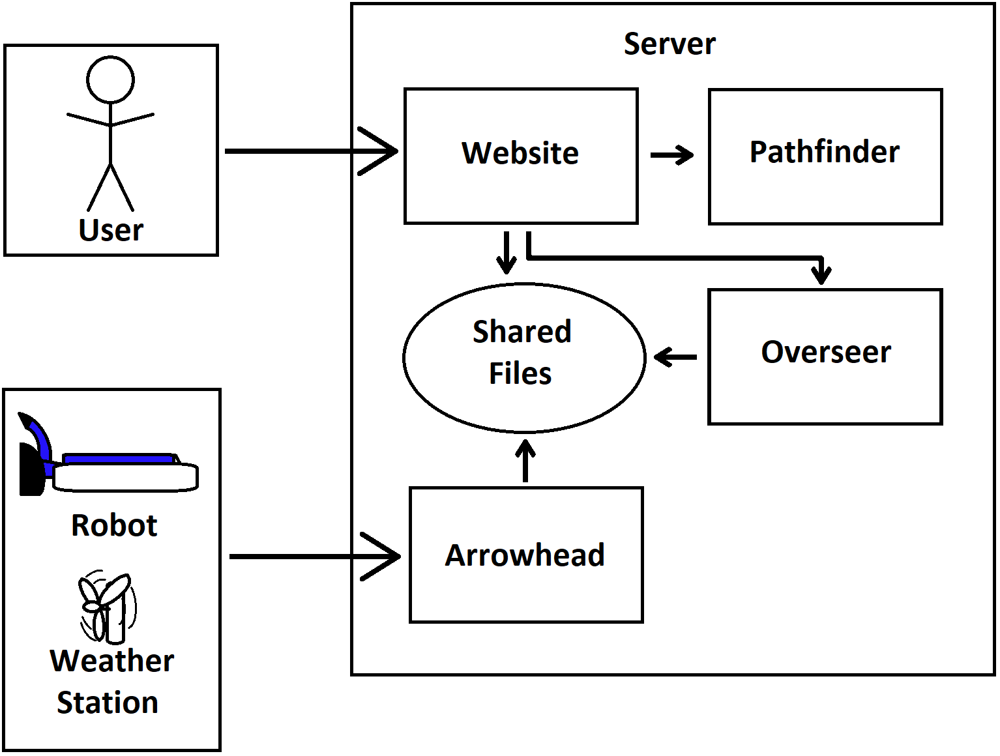
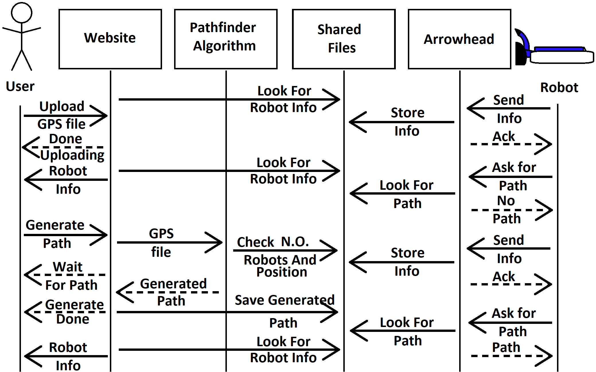
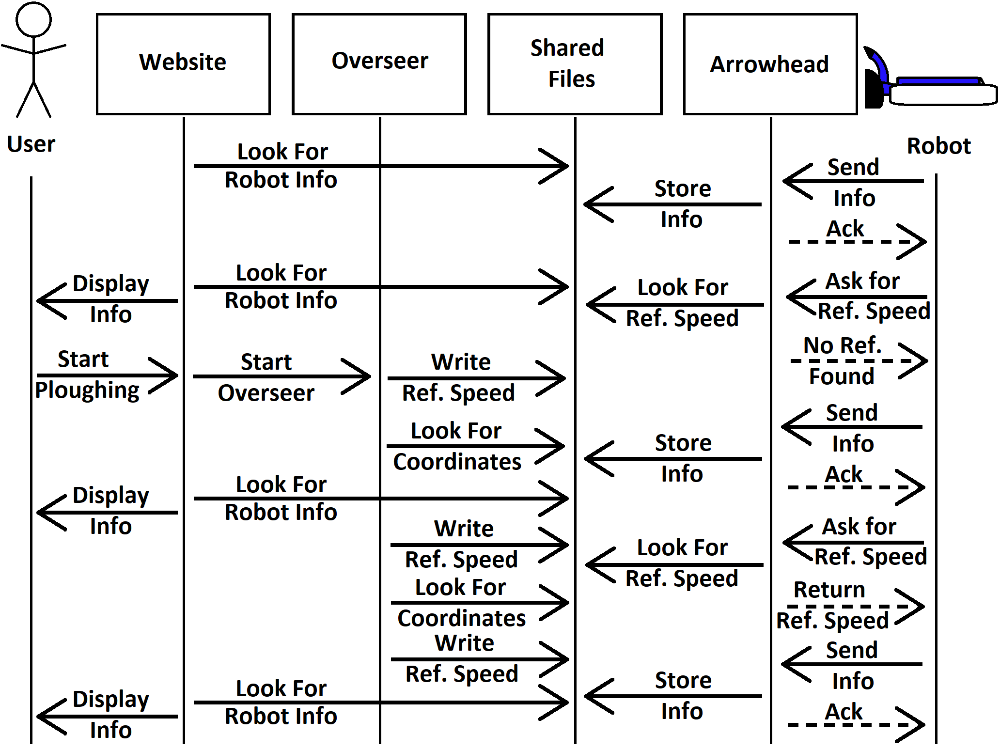

# Server 

The server will be live until the end of february 2022. If you want access to it please contact any project member or [Jan Van Deventer](https://www.ltu.se/staff/d/deventer-1.9887) at LTU.

A installed version of the server should look like this:

```bash
Website_Server
├── Arrowhead
│   ├── Arrowhead
│   │   └── Clone of Arrowhead repository https://github.com/Projektkurs-HT21/Arrowhead
│   └── core-java-spring
│       └── Arrowhead installation https://github.com/eclipse-arrowhead/core-java-spring
├── Control-Simulation
│   └── Clone of Control repository https://github.com/Projektkurs-HT21/Control-Simulation
├── Data
│   ├── ArrowheadData
│   ├── Robots
│   └── Weather
├── Pathfinder
│   └── Clone of Pathfinder repository https://github.com/Projektkurs-HT21/Pathfinder
├── website
│   ├── instance
│   ├── nix
│   │   ├── __init__.py
│   │   ├── static
│   │   │   └── styles.css
│   │   ├── templates
│   │   │   ├── delay_1500.html
│   │   │   ├── homePage.html
│   │   │   ├── index.html
│   │   │   ├── one_line.html
│   │   │   ├── upload_inner.html
│   │   │   └── upload.html
│   │   └── __pychache__
│   └── venv
├── uploaded_map
│   ├── inner.csv
│   └── outer.csv
├── .gitignore
├── README.md
└── run_nix
```

## Installation

When installing you will start by cloning the [Server repo](https://github.com/Projektkurs-HT21/Website_Server). Then inside that repo you will clone [Control](https://github.com/Projektkurs-HT21/Control-Simulation) and [Pathfinder](https://github.com/Projektkurs-HT21/Pathfinder). These should just work. If they don't work please checkout [Control-Simulation](https://github.com/Projektkurs-HT21/Control-Simulation/commit/83d2efc3ebafab64449d6ae5a4a7aa0db10cb350) and [Pathfinder](https://github.com/Projektkurs-HT21/Pathfinder/commit/253f98c04e00e41a37f083af78744e356993ceca). 

Then make a folder named _Arrowhead_ and enter it. Here we will clone the [Arrowhead repo](https://github.com/Projektkurs-HT21/Arrowhead) and then the installation repo [Installation Arrowhead](https://github.com/eclipse-arrowhead/core-java-spring). Now the installation of arrowhead starts. Please follow the instructions in our Arrowhead repo otherwise it can take days or weeks to install it. The only thing that may have changed in the guide is the version. So make sure that you install the right one. We cant ensure that the latest Arrowhead version will work. The version handling for Arrowhead has been terrible.

## Running

If your repository looks like this (it generates the Data and uploaded_map folder during run time) you should be able to run it. You need to make sure that you also have installed venv, created a virtual environment where it can live and installed all needed packages.

The main hub of the server is nix. Nix is snow in latin and the name of the website. To run the website simply chmod run_nix and run it. run_nix will try to kill any Arrowhead processes that is still running, start a new instance of Arrowhead and detach it. Then the website starts up and tries to publics it self on the Arrowhead cloud. The website will be put on 127.0.0.1:4999. If you want to change this it is located in run_nix.

All code for the website is in __init__.py. From there it will return different html files from templates corresponding to what site it should load.

There are 2 files that nix will run in other repositories. It is pathfinder located in _Control-Simulation/python/full\_test\_discrete/base\_controller.py_ and _Pathfinder/pathfinding/pathfinder.py_. The _base\_controller.py_ can be removed from it repo if wanted. This is the Overseer controller that controls the speed of all robots. The _pathfinder.py_ uses a lot of code form the rest of the repository so it needs to have the whole repository included. This is the file that creates a path from the rest of the repositories.

## Overview of server

A short visual overview of the server.



Providing path to robot.



Deployment of robots.

